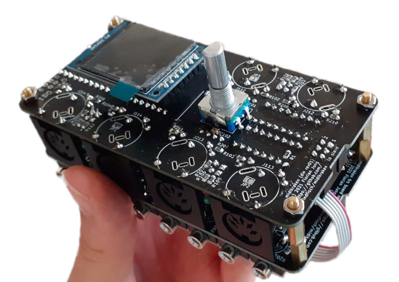

Midikraken
==========

An open-source, open-hardware MIDI-USB-interface supporting up to 16
(and maybe beyond?) MIDI ports. The hardware is based on a STM32F103
*"blue pill"* board which can be cheaply sourced from your favourite chinese
seller ([note about quality differences](https://github.com/Windfisch/analog-synth/blob/master/bluepill.md)),
plus other garden variety components such as HC2630 opto couplers (that's just
two 6N137 in one package), shift registers, some LEDs and resistors.

Apart from being a MIDI-USB-interface, Midikraken is a feature-packed MIDI
router supporting separate clock and note event routing, clock division.
Future features may include split-keyboard routing, clock generation or even a
hardware arpeggiator.

Below you will find a technical overview. [A user manual is available here](documentation/README.md).

Hardware
--------

Midikraken consists of two different PCBs that can be stacked (almost)
arbitrarily: [The DIN board](hardware/din5_pcb) has four traditional MIDI
in/out port pairs, and can house the master microcontroller.

[The TRS board](hardware/trs_pcb) gives you eight TRS MIDI pairs that support
both TRS-A and TRS-B. (Inputs are automatic, outputs need to be configured
in software). It can not house the microcontroller and thus cannot be used
without a DIN board.

The boards can be chained using their master/slave connectors and are
stackable using M3 screws / spacers. Currently, the firmware must be
adapted and recompiled according to the stack configuration. Currently,
a maximum of 16 port pairs is supported.

For information on the hardware, the revision history and errata, see
[the hardware documentation](hardware/README.md). A build guide for rev01
and rev02 [is available](documentation/build_guide/README.md).

Firmware
--------

The firmware is written in Rust and is released under the GPLv3 license.

Since the STM32F103 only offers 3 hardware UARTs, we need to emulate the UART
protocol in software. For this, a timer interrupt oversamples the UART input pins
with thrice the baudrate in order to always read a stable bit at a non-edge.
(Guaranteed 1/3 * bit time distance from any edge, so the signal should be quite
stable until then.)

[Benchmarks show](firmware/benchmark/README.md) that this can be done fast
enough for up to 16 software UARTs (and likely even more), while leaving
plenty of cpu cycles (25% for 16 UARTs) free for other work.

Further information about the firmware itself can be found
[in the firmware documentation](firmware/README.md).

License
-------

The software in the [firmware](firmware) directory can be redistributed
and/or modified under the terms of the
[GNU General Public License Version 3](gpl3.txt). Note this does not apply
to the [bootloader](firmware/sboot/sboot_stm32) which is under its own
license.

The hardware designs in the [hardware](hardware) directory, excluding
[hardware/lib/3d](hardware/lib/3d) to which own conditions apply, can be
licensed under the terms of the [CERN OHL Version 2 license](cern_ohl_s_v2.txt).
This specifically includes (but is not limited to) schematics, PCB designs and
gerber files.

Contributing
------------

I am happy about contributions, just open a pull request!

**Note:** Even though Midikraken is licensed under GPLv3 and OHL-S-v2 (the exact
versions), any contributions / pull requests must be licensed under the
"GPLv3 *or any later version*" or "OHL-S-v2 *or any later version*", respectively.
This is because on the one hand, I want to be able to update the project to new
versions of these licenses, but on the other hand, I don't like licensing my work
under a license (e.g. the hypothetical GPLv4) that I haven't even read yet. If such
a license is released, I will likely adopt it after revising it.
