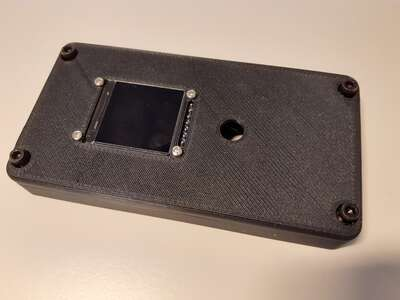

Midikraken build howto
======================

Since Midikraken is designed to be modular and is quite configurable, countless configuration
options exist. Not all of them can be described here, and not all of them have been actually tried.

The following guide will focus on the following configuration:
- One DIN5-board with a display and the microcontroller.
  (In [A1 B1 C+ D1 E1 configuration](../../hardware/README.md#board-variants))
- One TRS-board. (In [X1 Y1 configuration](../../hardware/README.md#board-variants))

This guide will leave up to you whether you want an enclosure or whether you prefer the half-open
configuration.

Step 1: Obtaining all parts
---------------------------

Check that you have obtained all parts from
[the din5 BOM](https://htmlpreview.github.io/?https://github.com/Windfisch/midikraken/blob/master/hardware/din5_pcb/ibom.html)
and [the TRS BOM](https://htmlpreview.github.io/?https://github.com/Windfisch/midikraken/blob/master/hardware/trs_pcb/ibom.html)
(except those in parentheses or those that say "as desired", we'll handle them separately).

Additionally, you require the following parts:

- 1x DIN5 PCB
- 1x TRS PCB
- 2 box connector terminators
- 5cm (or more) of 6x 1.27mm pitch wire for the box connectors.
- **if you want an enclosure**:
  - 3D prints of the three enclosure parts ([din5_shell](../../hardware/cad/din5_shell.FCStd),
    [trs_back_shell](../../hardware/cad/trs_back_shell.FCStd), [display_shell](../../hardware/cad/display_shell.FCStd)). Print
    them in any color your like, black PLA with 0.2mm layer height and 10% cubic infill worked fine
    for me. Rotate the DIN5 shell such that the enforcements are close to the bottom side; use
    paint-on-supports for the mounting latches and for the crossings of the enforcement beams. Use
    no support for the other shells.
  - 3D prints of the light guides: 4x [din5](../../hardware/cad/din5_lightguide.FCStd) and 8x
    [trs](../../hardware/cad/trs_lightguide.FCStd). These *must* be printed in transparent and with 100% infill.
    Overture transparent PETG at 0.1mm layer height worked fine for me.
  - 4x 16mm M3 hex screws
- **else if you prefer the half-open solution**:
  - 3D print of the [front plate](../../hardware/frontplate) (or fabricated PCB or any other means of
    manufacturing a plate).
  - One additional DIN5 *or* TRS PCB which is used as bottom plate, or [the bottom plate](../../hardware/backplate)
  - Optional: a 3d printed trs_back_shell is useful for aligning the LEDs during build.
  - 4x 6mm M3 screws
  - 4x 16mm brass spacers
  - 4x TODO mm brass spacers
- 4x 22mm brass spacers
- 4x M3 nuts
- 4x 6mm M2 screws
- 4x M2 nuts

Step 2: Soldering the PCBs
--------------------------

First, read the [instructions on how to fix rev01 boards](../rev01_fix/README.md).
Before soldering anything make the cuts described there.

It is expected that you know how to solder DIP and easy SMD components. A quick reminder:

- Use a soldering iron with a flat tip. Pointy tips are bad at transferring heat.
- Heat both the pin and the pad on the PCB well to ensure a good connection.
- Solder "from small to large" parts.

First, put together the blue pill board. You can use a second PCB to ensure that the pins are
soldered on straight.

The procedure for the DIN5 and TRS boards is mostly similar. In order to find out the correct part
values, please refer to
[the din5 BOM](https://htmlpreview.github.io/?https://github.com/Windfisch/midikraken/blob/master/hardware/din5_pcb/bom.html)
and [the TRS BOM](https://htmlpreview.github.io/?https://github.com/Windfisch/midikraken/blob/master/hardware/trs_pcb/bom.html).

0. If you have a rev01 board, ensure you cut the right traces on the PCB.
1. DIN5 board only: Close the following JP9 solder bridge by putting a blob of solder across the middle and upper
   pad, assuming that you use a 74HCT245 chip.
2. Solder all resistors and capacitors. (*A good procedure for this is to put some solder on
   *one* of the two pads, then grab the resistor with the tweezers and push it onto the solder blob
   while still heating the solder blob with your iron. Afterwards, put solder on the other side of
   the part as well. [Random video tutorial](https://www.youtube.com/watch?v=lrDyUj7ZfVI)*)
3. Proceed with all ICs. Ensure their correct orientation indicated by a latch on one side, or a
   small dot.
4. If you have a rev01 board, finish the fix by adding the resistors first (similar to the above
   procedure), and then attach the coated wire. Heating your soldering iron to 420C will easily burn
   away the wire coating and ensure good connection. You can now just heat a solder blob and stick
   the wire end into it.
5. Solder the box connectors ("to slave" on the DIN5 board, "from master" on the TRS board), and J3
   on the DIN5 board only. Ensure the correct orientation as denoted on the board.
6. DIN5 board only: Place the 1x20 pin headers on your blue pill board, then insert the header onto
   the PCB and solder it in. Then remove the blue pill board from the headers again.
7. Mount the TRS connectors.
8. Add the LEDs to the TRS board. Stick them
   through the holes so that the short lead is barly sticking out on the soldering side, then bend
   the LEDs over the TRS connectors. Do not rotate the board or they will fall out. When you have
   placed all LEDs, put the TRS case on and ensure all LEDs are held into the right position. Rotate
   the case-board-sandwich and solder the LEDs. Then remove the case again.
   The **long lead** (anode) goes into the **round hole**, and the short lead into the square hole.
9. Solder in the LEDs on the DIN5 board. First, put in the red led and fold it by 90 degrees; then
   put the green led behind and fold it such that it is above the red led.
   Again, the **long lead** (anode) goes into the **round hole**, and the short lead into the square hole.
10. Mount the DIN5 connectors.
11. DIN board only: on the opposite side, solder in the J8 header and the SW1 encoder. You will need
    to trim the two side legs a bit, or they would collide with the ICs on the other side. Soldering
    in the side legs is a bit tricky and must be done "from the wrong side". On the other hand,
    these side legs are optional and only provide stability. Be sure to solder in the rotary knob
    straight, mistakes are impossible to fix.

Finally, insert the 6-wire 1.27mm pitch lead into the box connector terminators as shown on the
photo. Don't waste wire length. Then push the terminators together with force so they cut
into the wire and form a connection.

Step 3: Testing basic functionality
-----------------------------------

Attach the bare blue pill board via USB to your computer. The power LED should light up and you
should see a Midikraken USB device. Disconnect USB.

Now place the blue pill board on the DIN5 board. Do not attach the display yet. Connect it to USB
again, you should see a Midikraken USB device again. Send some notes to one of the first four ports.
You should see the corresponding LED flashing. Connect a Midikraken's output to one of its inputs.
You should see the input LED flashing, too, when transmitting data. Use MIDI software to check that
you actually receive MIDI data on the input.

Disconnect USB, add the display into the header and re-connect USB. You should see the main menu.
Rotate the button and click to select a menu entry.

Disconnect USB, and connect the TRS board to the DIN5 board using the TRS board's "from master"
connector. Re-attach USB and send MIDI to one of the last eight ports. The TRS board's LEDs should
flash. Connect one of its outputs to one of its inputs, similarly, the input led should flash too
and your MIDI application should register data being received.

Remove all wires.

Step 4: Flashing the latest firmware
------------------------------------

Download the latest firmware from [here](https://github.com/Windfisch/midikraken/releases/tag/firmware_v0.1.1),
connect the device via USB and flash it using [these instructions](../firmware_upgrade/README.md).

Disconnect and reconnect USB to check whether the device still shows up as "Midikraken" USB device.
If it doesn't follow the recovery instructions under the link above.

Remove all wires.

Step 5a: If you have an enclosure: Enclosure assembly
-----------------------------------------------------

### Shell preparation

First, break of the supports from the DIN enclosure. Then trim away all 3d print artifacts using
a sharp blade:

Then snap in the transparent light guides into the TRS and DIN shells. Grab the TRS light guides
with a pair of tweezers, put the TRS case on its side and lay the light guides in place. Then
firmly press them into their holes, starting from the middle. Be sure to not break the walls off.

Use tweezers to remove the 3d print spaghetti from the screw slots in the TRS board. Grab a string
and twist it around until it comes off.

Mount the display into the display shell from below using the M2 screws and nuts.
Ensure you can slide the four M3 screws through the holes in the display shell. It might be
neccessary to insert them from the opposite side first and to clear any excess plastic / print
artifacts.

### Adding the boards

Slide the DIN5 case over the DIN5 connectors. Be sure to not cover the USB connector and that
the nose in the middle latches into the middle two DIN5 connectors for improved stability.

Plug in the master/slave cable into the TRS board's *"from master"* header and place the four M3 nuts into the slots in the
enclosure. Make sure they don't fall out. Put the TRS board on top. Once the board is in place, the
nuts are held in place and cannot fall out any more. Screw in the 22mm M3 brass spacers to lock
everything in place. Be sure that the master/slave cable comes out at the small slot in the PCB.

*Note: the photos show the wrong orientation. The cable must be inserted into "from master", not into
"to slave" as shown on the photos.*

Now plug in the cable into the "to slave" connector of the DIN5 board. Then place the TRS board on
top / below of the DIN5 board. Screw in the four M3 screws through the display shell and the DIN5
board into the brass spacers.

**Carefully** place the display shell on top of the DIN5 board. Ensure that the display pins have
actually met the display socket. Put the button knob on the button to provisorily lock the shell in
place. Attach USB and check whether the display still works. Disconnect USB again.

Congratulations, your Midikraken is complete. :)

Step 5b: If you prefer the half-open solution: Assembly
-------------------------------------------------------

Screw the 4x TODO mm spacers into the spare PCB / bottom plate and secure them with the M3 nuts.

Mount the TRS board on top using the 16mm spacers.

Connect the TRS board and the DIN5 board using the master/slave connections, put the DIN5 board on
top of the TRS board and screw in the 22mm spacers.

Mount the display into the display plate using the M2 screws and nuts.

**Carefully** place the display place on top of the 22mm spacers. Ensure that the display pins have
actually met the display socket. Screw everything together using the M3 screws.

Congratulations, your Midikraken is complete. :)

Troubleshooting
---------------

**All output leds on the TRS board are lit.** Is the cable should be plugged into the TRS board's "from
master" socket, as it should be?

**No display output.** Have the display pins actually met the display header on the board? Inserting them
right can be a bit tricky.

