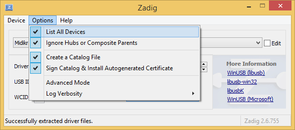
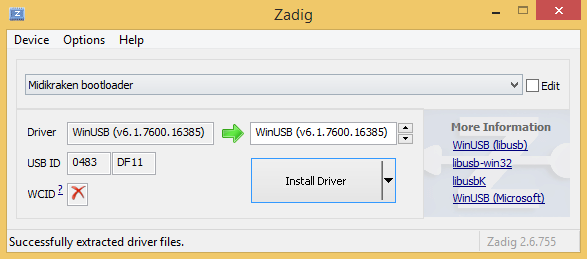

Upgrading the firmware
======================

If a new firmware is released, you can easily upgrade your Midikraken to the most recent version
via USB. First, download the firmware image from [here](https://github.com/Windfisch/midikraken/releases),
then follow the steps below depending on
your operating system. **Do not unplug the device during the flash procedure or you might damage
the firmware.**

If, however, your Midikraken failed to upgrade and now is in an inoperable state and does not show up
as USB device, read the rescuing section below.

## Linux

Only if you are flashing the firmware for the first time, give your user permission to flash the device
by executing the following as root user:

```
gpasswd plugdev -a YOUR_USERNAME_HERE    # note: if the plugdev group does not exist, replace it by "uucp" in all steps
echo 'SUBSYSTEMS=="usb", ATTRS{idVendor}=="1209", ATTRS{idProduct}=="2e7f", GROUP="plugdev", MODE="0666"' >> /etc/udev/rules.d/50-dfu.rules
udevadm control --reload
```

To actually flash the firmware, as your normal user account, extract the firmware zip, open a
terminal, navigate to the extracted files and execute the `flash.sh` script.

## Windows

Unpack the firmware package.

If you are flashing the firmware for the first time, you need to install the WinUSB driver first.
To do so, execute the `install_driver.bat` script from the firmware package with the device attached.
This will reset Midikraken into bootloader mode, and then open Zadig. Open the *Options* menu and check
*"List All Devices"*. Then, from the combo box, select *"Midikraken bootloader"*. Next to the green arrow,
select *"WinUSB"*. Then click *"Install driver"* and close Zadig.




Now you are ready to flash the firmware by executing `flash.bat`.

## Mac OS

TODO. Probably you want to use [brew](https://brew.sh/) to install `dfu-util`, send the `bootloader.syx`
SysEx to output 1 of your midikraken somehow, and then upgrade the firmware as described in the Linux
section using dfu-util.

Rescuing the firmware
=====================

If the device does not show up via USB and the display does not work any more, likely the firmware
was damaged.

Midikraken contains a bootloader, i.e. a small program that allows the device to self-update via USB.
This bootloader is usually called from the firmware, but if the firmware is damaged, it is possible
to force Midikraken into the bootloader mode.

To do so, unscrew the top shell and carefully detach the DIN5+display assembly from the TRS board.
Be sure to not rip out the cable. You now are able to view the top side of the STM32 blue pill board.
Locate the pins labelled "B12" and "G" that are left and right of the USB port. Unplug the USB cable,
then use a pair of tweezers to connect the "B12" pin with "G". Plug in the USB cable while shorting
these two pins. Now a "Midikraken bootloader" device should show up. Proceed to flash the firmware
as usual.

In the highly unlikely event that you have a defective bootloader, you will need additional hardware
to re-flash the bootloader. This can be done either using a UART adapter or using a JTAG/SWD debugger,
e.g. a STLINK or a Blackmagic probe. Follow
[these instructions](https://github.com/Windfisch/midikraken/blob/master/firmware/sboot/README.md) to
build and flash the bootloader.
