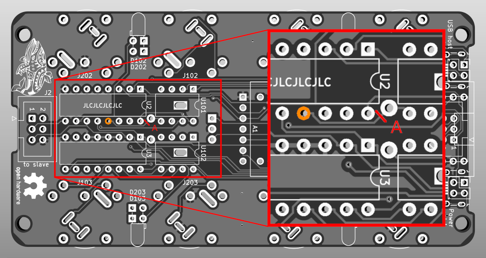
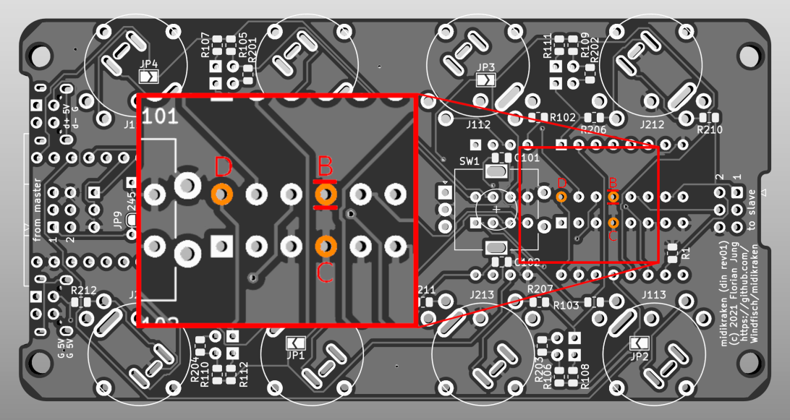
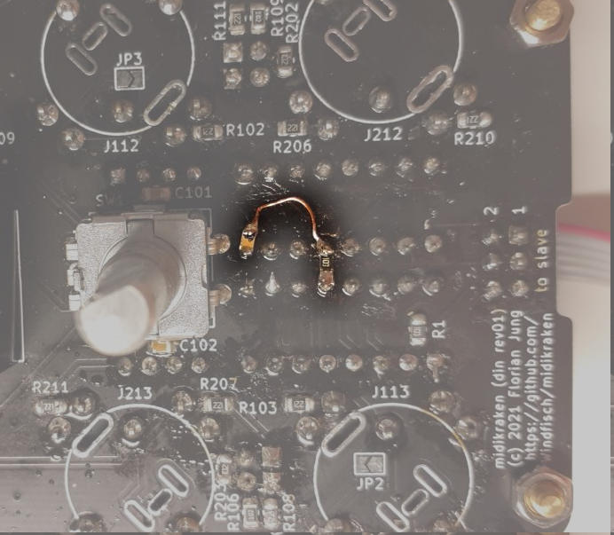
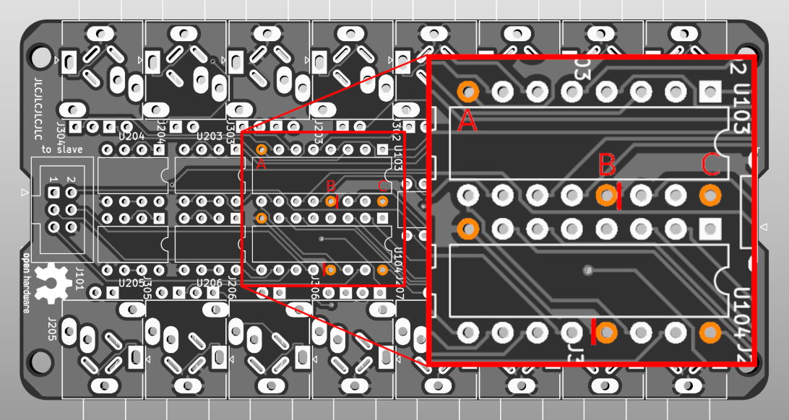

# Fixing the DIN board

During powerup, the MIDI ports send garbage bits. To fix this, follow the
steps below. This will delay the *output enable* signal of the output drivers
long enough that the software can set them in their idle states.

## Procedure

On the front side, cut trace A that connects U2's pin 13 to GND. The cut
is marked in red.

On the back side, cut the two traces at B that connect the same pin to GND.
Then solder a 10k resistor between pins B and C. Solder a 10uF capacitor
to pin D, and connect the other end of the capacitor to pin B using enameled
copper wire.

In the end, the fix could look like this:

#### Fixing the TRS board

On the front side, cut the two traces marked in red. Then wire a 10uF capacitor from
B to C and a 10k resistor from A to B. It works best to place the resistor on pin A
and the capacitor on pin C, and then run a copper wire from the resistor's other end
across pin B finally to the capacitor's other end.

Doing this once is enough since both ICs' OE
pins are still connected with each other.

