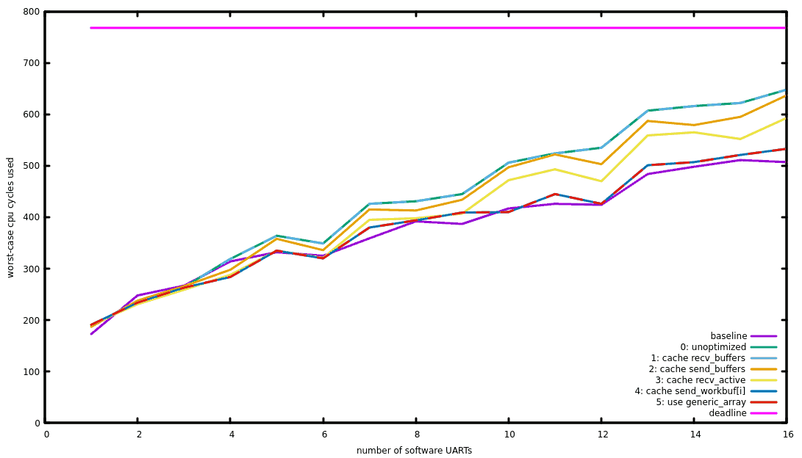

# Manual optimization and benchmarking results



**baseline**: The (mostly unoptimized) software UART was written in Rust and
was tightly integrated with the rest of the program. This yielded the best
results, since any compiler optimizations were easy to see by the compiler.

**0: unoptimized**: By factoring out the software UART into a struct and a
separate file, the compiler could not see some optimizations any more and
generated slower code. While it did inline all code in the `TIM2` handler
as with *baseline*, it created slightly more verbose code and thus failed
to use the `itttt` instruction to avoid conditional branches in some cases.
Also, it did generate unneccessary load and store instructions which could
be avoided by keeping values in the registers.

**1: cache recv_buffers**: Precalculating the array address had no positive effect

```diff
diff --git a/firmware/src/software_uart.rs b/firmware/src/software_uart.rs
index 473ed1b..7e7f1da 100644
--- a/firmware/src/software_uart.rs
+++ b/firmware/src/software_uart.rs
@@ -214,6 +214,7 @@ impl<'a> SoftwareUartIsr<'a> {
                self.recv_active[next_phase] |= start_of_transmission;
 
                let mut recv_finished = 0;
+               let recv_buffers = unsafe { addr_of_mut!((*self.registers).recv_buffers) };
                for i in 0..N_UART {
                        let mask = 1 << i;

@@ -228,7 +229,7 @@ impl<'a> SoftwareUartIsr<'a> {
                                self.recv_workbuf[i] = (self.recv_workbuf[i] >> 1) | recv_bit;
 
                                if self.recv_workbuf[i] & 1 != 0 { // we received 10 bits, i.e. the marker bit is now the LSB?
-                                       unsafe { write_volatile(addr_of_mut!((*self.registers).recv_buffers[i]), self.recv_workbuf[i]); } // publish the received uart frame.
+                                       unsafe { write_volatile(addr_of_mut!((*recv_buffers)[i]), self.recv_workbuf[i]); } // publish the received uart frame.
                                        self.recv_workbuf[i] = RECV_BIT;
                                        recv_finished |= mask;
```

**2: cache send_buffers** considerably improved performance at the sending loop by avoiding accessing the `registers`
pointer in every loop iteration.

```diff
diff --git a/firmware/src/software_uart.rs b/firmware/src/software_uart.rs
index 7e7f1da..da5c8d7 100644
--- a/firmware/src/software_uart.rs
+++ b/firmware/src/software_uart.rs
@@ -239,12 +239,13 @@ impl<'a> SoftwareUartIsr<'a> {
 
                // handle the bits to be sent; in three thirdclocks, we prepare *out_bits.
                const SEND_BATCHSIZE: usize = (N_UART+2) / 3;
+               let send_buffers = unsafe { addr_of_mut!((*self.registers).send_buffers) };
                let first = self.phase * SEND_BATCHSIZE;
                for i in first .. core::cmp::min(first + SEND_BATCHSIZE, N_UART) {
                        if self.send_workbuf[i] == 0 {
                                unsafe { // STM32 reads and writes u16s atomically
-                                       self.send_workbuf[i] = read_volatile(addr_of!((*self.registers).send_buffers[i]));
-                                       write_volatile(addr_of_mut!((*self.registers).send_buffers[i]), UART_SEND_IDLE);
+                                       self.send_workbuf[i] = read_volatile(addr_of!((*send_buffers)[i]));
+                                       write_volatile(addr_of_mut!((*send_buffers)[i]), UART_SEND_IDLE);
                                }
                        }
```

**3: cache recv_active** further improved performance by avoiding repeated reads of `recv_active[phase]`:

```diff
diff --git a/firmware/src/software_uart.rs b/firmware/src/software_uart.rs
index da5c8d7..bae34fd 100644
--- a/firmware/src/software_uart.rs
+++ b/firmware/src/software_uart.rs
@@ -215,11 +215,11 @@ impl<'a> SoftwareUartIsr<'a> {
 
                let mut recv_finished = 0;
                let recv_buffers = unsafe { addr_of_mut!((*self.registers).recv_buffers) };
+               let recv_active = self.recv_active[self.phase];
                for i in 0..N_UART {
                        let mask = 1 << i;

-                       // TODO try moving this variable out of the loop. does this avoid unneeded reads / array bound checks?
-                       if self.recv_active[self.phase] & mask != 0 { // this is the thirdclock where uart #i can read stable data?
+                       if recv_active & mask != 0 { // this is the thirdclock where uart #i can read stable data?
                                /*let mut recv_bit = 0;
                                if in_bits & mask != 0 {
                                        recv_bit = RECV_BIT;
```

**4: cache send_workbuf[i]**: By fetching `send_workbuf[i]` into a temporary variable, doing all operations
on that variable and only writing back the value at the end, more read/write cycles could be saved:

```diff
diff --git a/firmware/src/software_uart.rs b/firmware/src/software_uart.rs
index bae34fd..4864266 100644
--- a/firmware/src/software_uart.rs
+++ b/firmware/src/software_uart.rs
@@ -242,15 +242,16 @@ impl<'a> SoftwareUartIsr<'a> {
                let send_buffers = unsafe { addr_of_mut!((*self.registers).send_buffers) };
                let first = self.phase * SEND_BATCHSIZE;
                for i in first .. core::cmp::min(first + SEND_BATCHSIZE, N_UART) {
-                       if self.send_workbuf[i] == 0 {
+                       let mut workbuf = self.send_workbuf[i];
+                       if workbuf == 0 {
                                unsafe { // STM32 reads and writes u16s atomically
-                                       self.send_workbuf[i] = read_volatile(addr_of!((*send_buffers)[i]));
+                                       workbuf = read_volatile(addr_of!((*send_buffers)[i]));
                                        write_volatile(addr_of_mut!((*send_buffers)[i]), UART_SEND_IDLE);
                                }
                        }
                        
-                       self.out_bits |= (self.send_workbuf[i] & 1) << i;
-                       self.send_workbuf[i] >>= 1;
+                       self.out_bits |= (workbuf & 1) << i;
+                       self.send_workbuf[i] = workbuf >> 1;
                }
 
                self.phase = next_phase;
```

**5: use generic_array**: Using the `generic_array` crate to be able to specify the number of uarts as a template argument
did not change anything, as expected:

```diff
diff --git a/firmware/src/software_uart.rs b/firmware/src/software_uart.rs
index 4864266..e890dc8 100644
--- a/firmware/src/software_uart.rs
+++ b/firmware/src/software_uart.rs
@@ -66,50 +68,54 @@ const APP: () = {
        // TODO FIXME: finish the example
   * ```
   */
-pub struct SoftwareUart {
-       send_buffers: [u16; N_UART],
-       recv_buffers: [u16; N_UART],
+pub struct SoftwareUart<NumUarts: Unsigned + ArrayLength<u16>> {
+       send_buffers: GenericArray<u16, NumUarts>,
+       recv_buffers: GenericArray<u16, NumUarts>,
 }
...
```
