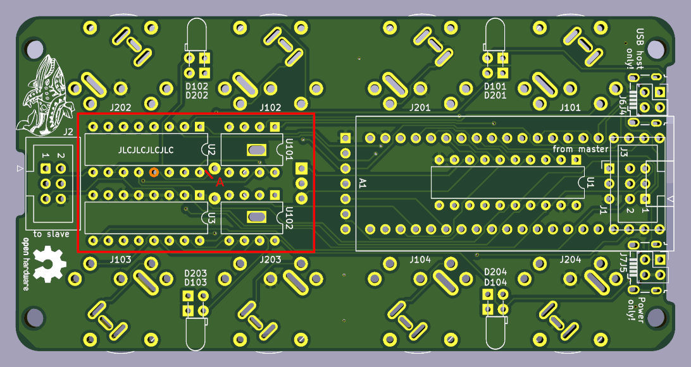
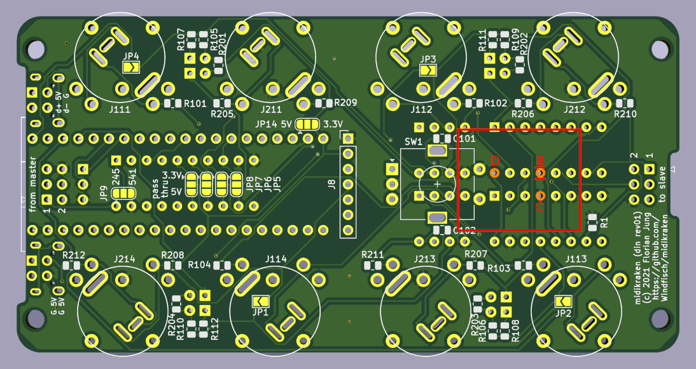
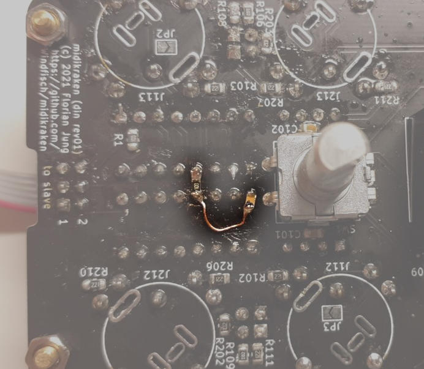
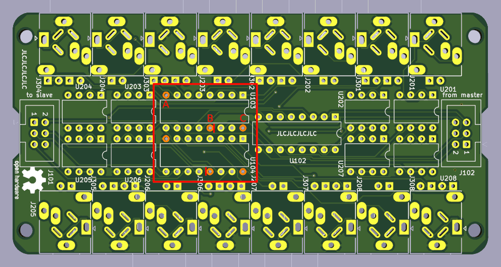

Midikraken hardware
===================

Midikraken boards are meant to be **stacked** using M3 spacers and screws.
In such a setup, one "master" exists that holds the microcontroller with
the USB port, and zero or multiple "slaves" are daisy-chained with their
upstream ("from master") or downstream ("to slave") ports.


The photo shows an (almost) fully equipped Midikraken including:

- 1 DIN connector board (the large MIDI connectors).
- 1 TRS connector board (MIDI via headphone jacks).
- The main microcontroller
- The UI consisting of a display and a rotary encoder.

Note that the UI is not implemented in software yet and thus has no function.

Midikraken boards can be stacked almost arbitrarily; the only limit is
(currently) a maximum of 16 MIDI in/out port pairs.

Two board types are available:
- The DIN board with four DIN MIDI inputs and four outputs
- and the TRS board with eight TRS inputs and eight outputs.

DIN boards may or may not house the main microcontroller, so every stack needs
one. Note that the DIN board can be used to house only the microcontroller, if
desired. No actual MIDI ports need to be equipped, making a TRS-only stack
possible.

The TRS board supports both TRS-MIDI-A and -B (where roles of tip and ring
are swapped).

Note that while it would be possible to design boards with
only inputs or only outputs, the current boards do *not* support switching
an input port to output mode or vice versa. If desired, however, inputs
can be left unmounted; in this case, the appropriate LEDs and opto-couplers
can be left out, too.

Board variants
--------------

Both boards can be built in different variants. For the DIN board, the options
include:

- It can either house the **microcontroller** *(A1)* or act as a **slave** *(A2).
- It can hold **angled MIDI connectors** (*B1*, the default), or **not have any connectors** *(B2)*.
  (This is useful when used as user interface board only). *(Additionally, there
  is a somewhat hacky way to mount upward-facing MIDI connectors to it for use
  in Eurorack setups, but that's dirty and untested.)*
- If the board is configured as a master, it can or can not have a **user
  interface** *(C)* consisting of a display and a rotary knob with a push button.
- If the board holds a microcontroller, it can support chaining more boards to it *(D1)*,
  or save some components at the cost of losing the chaining ability *(D2)*. (*not
  recommended*).
- In this case, MIDI can be driven with 5V *(E1)* or with 3.3V *(E2, saves another chip, 
  not recommended)*.
- As a the buffer U1, a 74HCT245 *(F1)* or 74HCT541 *(F2)* can be used.

For the TRS board, two options are available:
- Either 8 in/out port pairs are mounted *(X1)*
- or only one side is equipped with only 4 in/out pairs *(X2)*
- **Angled TRS jacks** (PJ-324) *(Y1)* or **upright** TRS jacks *(Y2)* can be used.

The following components need or need not be mounted on the PCB:
- *(A1)*: mount A1, J1, U1; leave J3 unmounted.
- *(A2)*: mount J3, leave A1, J1, U1 unmounted.
- *(B1)*: mount J10x and J20x, U101, U102, U2, U3 and Dxxx.
- *(B2)*: do not mount the components from *(B1)*, instead run a copper wire across *TODO*.
- *(C)*: mount or do not mount J8 and SW1.
- *(D2)*: Close JP1-4, and close JP5-8 according to your selection in *(E)*.
- *(F)*: Configure JP9 accordingly.
- *(X2)*: Close JP102 and do not mount Jx05-Jx08, and all LEDs and resistors on this side.
 Also do not mount U205-U208.
- *(Y)*: Solder in what is needed, the PCB can hold both.

**Note:** While this sounds complicated, in the recommended default configuration which is reflected
by the BOM and schematics, only JP9 needs to be closed to select the IC type used in U1. All other
solder bridges are left open and no deviations from the schematic need to be made, except for *(A)*.


Currently, two different hardware revisions exist. They are described here from most recent to
oldest.

Revision 01
-----------

### Bill of material

[din5_pcb/bom.html](https://htmlpreview.github.io/?https://github.com/Windfisch/midikraken/blob/master/hardware/din5_pcb/bom.html)

[trs_pcb/bom.html](https://htmlpreview.github.io/?https://github.com/Windfisch/midikraken/blob/master/hardware/trs_pcb/bom.html)


### Errata

During powerup, the MIDI ports send garbage bits. To fix this,
you likely need to disconnect the 74HC595s' *output enable* pins from GND
using a sharp knife (and some wire to reconnect all GNDs that should stay
connected), and connecting them like this instead:

```
+5V --- Capacitor 10µF --- OE pin --- Resistor 10k --- GND
```

This delays the output enable enough such that the shift registers can
be filled with proper data after the microcontroller has booted up.

#### Fixing the DIN board

On the front side, cut trace A that connects U2's pin 13 to GND. The cut
is marked in red.



On the back side, cut the two traces at B that connect the same pin to GND.
Then solder a 10k resistor between pins B and C. Solder a 10uF capacitor
to pin D, and connect the other end of the capacitor to pin B using enameled
cupper wire.



In the end, the fix could look like this:



#### Fixing the TRS board

On the front side, cut the two traces marked in red. Then wire a capacitor from
B to C and a resistor from A to B. Doing this once is enough since both ICs' OE
pins are still connected with each other.




### Eurorack compatibility

Please note that Midikraken was designed as a standalone adapter box. However,
where possible, efforts were made to make Midikraken as Eurorack compatible as
possible:

- The PCBs are 110mm in height, fitting tightly into any Eurorack setup.
- The boards are prepared for upright connectors. This is sort of hacky, but it
  might work. The TRS board can hold PJ392 sockets that are usually meant to
  have wires soldered to their legs. The DIN board can hold DIN sockets similar
  to the NYS325, with a hack: The outermost two solder tail must be removed, and
  the remaining three must be bent so that they fit into the PCB.
- Alternatively, any socket can be used and wires can be soldered to the PCB.

Ghettokraken on perfboard
-------------------------

Schematics for the first prototype board were created with KiCAD and are
located in [perfboard](perfboard).

A 3D-printed enclosure (which needs some adjustments to fit well) was
designed in FreeCAD and resides in [perfboard/cad/](perfboard/cad/).
The enclose provides the DIN ports with additional stability which the
usual perfboards lack.

**Note**: You need to use the firmware from 7072a0c6eb or earlier due
different pin assignment; or you reassign the pins.

